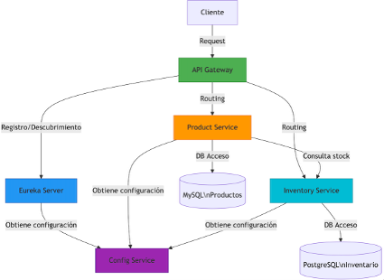
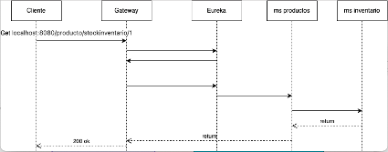

# Proyecto-Final
Proyecto final del Boot Camp

## Introducción

La idea inicial es la realización de un sitio de ventas usando microservicios en el cual involucra muchos microservicios 
entre los cuales están los de microservicios de productos e inventario que fue la sugerencia que nos hicieron en la sesión de proyecto final.

### Microservicio de gestion de productos

Se considerarán las operaciones CRUD para el manejo de productos
- Agregar productos (comunicacion con el microservicio de inventario)
- Editar información de un producto
- Eliminar producto 
- Recuperar la informacion de un producto (comunicacion con el microservicio de inventarios para ver sus existencias en stock)

### Microservicio de inventario

Se considerará la gestion del inventario/stock de los productos
 - Informar del stock de un producto (el microservicio de productos realizara la solicitud)
 - Aumentar el stock (Cuando se realiza una compra a un proveedor y se actualiza con los productos recibidos)
 - Decrementar el stock (cuando una venta se confirma)
 - Historial de movimientos por producto (Entradas, Salidas, Ajustes)

### Alcance del proyecto

Como se ha mencionado anteriormente el objetivo es implementar el sitio de ventas pero para esta entrega solo se implementará 
el CRUD de productos y para inventario solo recuperaremos la información de la información de stock de los productos.

### Arquitectura de Microservicios
 -	API Gateway: Punto de entrada único para todas las solicitudes (Spring Cloud Gateway)
 - Eureka Server: Servicio de descubrimiento y registro de microservicios
 - Config Service: Servicio centralizado de configuración
 - Product Service: Gestión de productos (MySQL)
 - Inventory Service: Gestión de inventario (PostgreSQL)

Como se mencionó antes solo implemente 2 microservicios los cuales tienen su propia base de datos como se muestra en el
diagrama, como no tengo experiencia en microservicios estuve investigando y recomendaban un punto de entrada único por 
lo que agregue ese microservicio que llaman api Gateway (Spring Cloud Gateway) , también vi que era necesario tener un 
microservicio para poder registrar los microservicios entonces agregue  un microservicio que funciona como Eureka Server 
y al final se agregó un microservicio que funciona para tener toda la configuración de los microservicios

### Flujo de Comunicación
1.	Los servicios se registran en Eureka al iniciar
2.	El API Gateway consulta Eureka para localizar servicios
3.	Los servicios obtienen su configuración del Config Service
4.	El microservicio de productos consulta inventario mediante llamada REST directa al microservicio de inventario

Configuración de Bases de Datos
 - Microservicio de productos
 - - MYSQL
 - - - jdbc:mysql://localhost:3306/productodb
 - Mroservicio de inventario
 - - PostgreSQL
 - - - jdbc:postgresql://localhost:5432/inventariodb

### Diagrama de Secuencia

1.	El punto de entrada único es mediante el microservicio de api Gateway (Spring Cloud Gateway)
2.	El microservicio de producto contiene la gestión de catálogo de productos
      a.	Endpoints: /producto/ (GET, POST, PUT, DELETE)
3.	El microservicio de inventario maneja el control del stock
      a.	Endpoints: /inventario/ (GET)
4.	La comunicación entre el microservicio de productos con el microservicio de inventario se realiza vía comunicación REST (consulta stock vía HTTP)

### Configuración de Puertos
|Servicio	|Puerto	|URL Acceso  |
|-----------|-------|------------|
|API Gateway	|8080	|http://localhost:8080|
|MS Eureka Server 	|8761	|http://localhost:8761|
|MS Config	|8888	|http://localhost:8888|
|MS Productos	|9090	|http://localhost:9090|
|Inventario	|8090	|http://localhost:8090|

